# dev-pipeline-skills · 研发全流程 skill 套件

一套面向"软件平台从零到汇报"的个人 Codex skill：把需求说明一路推进成**需求报告 → 详细设计 → 可运行平台 → 测试大纲 → 创新报告 → 效果演示视频 → 汇报 PPT**。
每个 skill 独立成包、可单独拷贝，全部使用相对路径，便于整体迁移；链路由一个编排 skill 统一调度。


## 它能做什么

| 能力 | 说明 |
|---|---|
| 阶段自动判定 | 扫描目录里的特征产物，判断当前处在哪一步，并给出下一步该交给谁 |
| 按名调度 | 编排层只引用 skill 名称，不写死路径；换机器、换用户名都不影响 |
| 目录与交付物治理 | `docs/`（文档）、`platform/`（代码）、`demos/`（视频与图片，不清理）、`work/`（中间结果，可整包清理）、`deliver/`（对外交付）+ `CONTEXT.md` / `PROJECT_INDEX.md` |
| 多层级目标架构 | `L0 总目标 → L1 环节 → L2 能力 → L3 任务` + 约束与关键路径登记，防止做局部功能时丢掉总目标 |
| 每阶段清理 | 只清理 `work/` 内的脚本与临时数据，且先征求确认；演示视频与配图保留给 PPT/DOCX 复用 |
| 进程卫生 | 只结束本会话自己启动的进程；默认只读自查，绝不按进程名批量杀 |
| 真实取证出片 | 演示视频走真实操作 + CDP 无损取帧 + 逐镜验收（字幕合规、音画时长账、标注窗口、代表帧非空） |

## 仓库结构

```text
dev-pipeline-skills/
|-- README.md                     # 本文件
|-- SKILLS.md                     # 总说明与录入清单（每个 skill 的 name/description/文件构成）
|-- dev-pipeline-conductor/       # 编排层（先装这个）
|-- req-analysis-report/          # S1 需求分析报告
|-- detailed-design-report/       # S2 详细设计报告
|-- fullstack-dev-contract/       # S3 开发约束 + 功能测试
|-- test-outline-report/          # S4 测试大纲
|-- tech-summary-report/          # S5 创新报告 / S7 报告二次生成（含 docx）
|-- demo-narration-design/        # S6 演示视频生产线（自包含）
|-- demo-video-pipeline/          # S6 轻量视频管线（与上一个二选一）
|-- slide-deck-design/            # S7 汇报 PPT（自带离线依赖）
`-- svg-infographic/              # 配图：单页信息图 SVG
```

> 每个目录都是一个可独立 zip 的 skill 包；`demo-video-pipeline` 与 `demo-narration-design` 存在同名脚本，**二者不必同时安装**。

## 安装

1. 把需要的 skill 目录（或解压后的 zip）放进 skills 目录：
   - `%CODEX_HOME%/skills/`（Windows）
   - `~/.codex/skills/`（未设置 `CODEX_HOME` 时）
2. 目录名必须与 `SKILL.md` 里的 `name` 一致（本仓库已保持一致，直接解压即可）。
3. 装完先自检：
   - 编排层：`python dev-pipeline-conductor/scripts/project_stage.py <项目根>`
   - 文档类（docx）：`python tech-summary-report/scripts/doctor.py`
   - 视频类：`python demo-narration-design/scripts/doctor.py`
   - PPT/SVG：跑对应的 `check_*` / `audit_deck_*` 脚本

## 快速开始

在项目根目录里对 Codex 说：

```text
用 dev-pipeline-conductor 看一下这个项目现在到哪一步了，并推进下一步。
```

编排层会：判定阶段 → 建/更新 `CONTEXT.md`（目标树、约束、关键路径）与 `PROJECT_INDEX.md` → 按名称调度对应 skill → 阶段末提议清理 `work/`。

只想做单点交付物时，直接点名专项 skill，例如：

```text
用 req-analysis-report 把这份需求说明写成正式需求分析报告。
用 demo-narration-design 给这个平台录一条效果演示视频（用例与期望结论我另外给）。
用 slide-deck-design 把这份技术报告做成汇报 PPT。
```

## 端到端链路

```mermaid
flowchart LR
    U["需求说明"] --> C["dev-pipeline-conductor"]
    C --> A1["req-analysis-report"] --> O1["需求分析报告"]
    O1 --> A2["detailed-design-report"] --> O2["详细设计报告"]
    O2 --> A3["fullstack-dev-contract"] --> O3["可运行平台"]
    O3 --> A4["test-outline-report"] --> O4["测试大纲 + 执行记录"]
    O4 --> A5["tech-summary-report"] --> O5["技术总结与创新点"]
    O5 --> A6["demo-narration-design"] --> O6["成片 + 配图 + 数据集"]
    O6 --> A7["slide-deck-design"] --> O7["汇报 PPT"]
    O5 --> A7
    A7 -->|回填效果图| A5
```



## 环境要求

| 能力 | 依赖 |
|---|---|
| 阶段判定 / 目标卡 / 进程自查 | Python 3.8+（进程自查建议装 `psutil`，缺失时自动降级为提示） |
| 需求/方案/测试/创新报告 | 无额外依赖；docx 导出需本机 Word 或 pandoc（`tech-summary-report/scripts/doctor.py` 自检） |
| 演示视频 | Playwright + Chromium、`opencv-python`、`Pillow`、Windows SAPI 中文语音、可用的 H.264 编码器 |
| 汇报 PPT | 自带 `vendor/` 离线依赖与 wheel，目标机无需联网 |
| 信息图 SVG | 纯 Python + 校验脚本 |

## 使用约定（重要）

- **不写死路径**：skill 内只出现相对路径与 skill 名称，便于 zip 转移与跨机器复用。
- **目录分工**：中间产物一律进 `work/`；`demos/` 只增不删（后续要填 PPT/DOCX）；对外交付进 `deliver/`。
- **清理要确认**：清理前先列清单并征求确认，删除范围严格限定在 `work/` 内。
- **进程边界**：只结束后台由本会话启动的进程，禁止按进程名批量杀（同名进程很可能是别人的任务）。
- **画面只讲平台**：演示视频的台词、字幕、框标注不得出现"本视频/镜头/录制/剪辑"等制作侧自述。
- **数据要可复现**：上传型平台若缺样例数据，必须自建并按平台真实判据口径自校验（正常用例落在合格域、缺陷用例只在少数对象越界），生成脚本与种子入库。

## 打包与发布

```text
# 每个 skill 一个 zip，zip 名 = 目录名 = SKILL.md 的 name
dev-pipeline-conductor.zip
req-analysis-report.zip
...
slide-deck-design.zip        # 32 MB 量级，保持 vendor/ 完整
```

打包前检查：

- [ ] 目录内无盘符/用户名绝对路径；
- [ ] 脚本依赖齐全（大包带 `vendor/` 与 wheel）；
- [ ] 同名脚本冲突只保留一个入口；
- [ ] 目标机跑一次自检脚本无误。

## 版本与许可

- 面向个人使用与自建交付；第三方能力（pptx/docx/pdf/表格）依赖 Codex 平台自带插件。
- 若用于团队分发，建议在仓库内保留 `SKILLS.md` 作为录入清单，并在每次改动后同步更新其中的 `description`。
