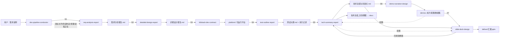

# 研发全流程 skill 套件 · 总说明（录入版）

一套面向"软件平台从零到汇报"的个人 Codex skill：把需求说明一路推进成**需求报告 → 详细设计 → 可运行平台 → 测试大纲 → 创新报告 → 效果演示视频 → 汇报 PPT**。
每个 skill 独立成包、可单独拷贝，全部使用相对路径，便于整体迁移；链路由一个编排 skill 统一调度。

> 这套 skill 覆盖"需求 → 方案 → 开发 → 测试 → 创新报告 → 演示视频 → 汇报物"全链路。
> 每个 skill 独立成包、可单独 zip 转移；本文件是**总说明与录入清单**，逐条给出可直接登记的 `name / description`、角色、输入输出与文件构成。
> 所有路径均以项目根或 skill 目录为基准，不含盘符与用户名路径。

## 一、总览

| #  | skill                      | 角色                                                         | 触发时机                                     | 输入 → 输出                                                                            | 体量                        | 自包含                            |
| -- | -------------------------- | ------------------------------------------------------------ | -------------------------------------------- | --------------------------------------------------------------------------------------- | --------------------------- | --------------------------------- |
| 1  | `dev-pipeline-conductor` | 编排层：判阶段、按名调度、管目录与交付物、目标架构、进程卫生 | "这个项目做到哪了/下一步做什么/推进整条链路" | 需求说明或现有产物 →`CONTEXT.md`、`PROJECT_INDEX.md` 与阶段推进                    | 8 文件 / 36 KB              | 是                                |
| 2  | `req-analysis-report`    | 需求分析报告                                                 | 需要正式需求文档时                           | 需求说明 →`docs/需求分析报告.md`                                                     | 3 / 25 KB                   | 是                                |
| 3  | `detailed-design-report` | 详细设计/方案报告                                            | 需求冻结后做设计                             | 需求报告 →`docs/详细设计报告.md`                                                     | 3 / 45 KB                   | 是                                |
| 4  | `fullstack-dev-contract` | 代码开发约束 + 功能测试                                      | 写/改 Python 平台代码                        | 方案报告 →`platform/` 可运行工程                                                     | 6 / 46 KB                   | 是                                |
| 5  | `test-outline-report`    | 测试大纲/方案                                                | 平台可运行后                                 | 平台 + 需求/方案 →`docs/测试大纲.md` + 执行记录                                      | 2 / 11 KB                   | 是                                |
| 6  | `tech-summary-report`    | 创新报告 + 报告二次生成                                      | 有实测结果后、以及补效果图时                 | 前序产物 →`docs/技术总结与创新点.md` → docx                                         | 7 / 84 KB                   | 是（docx 转换需本机 Word/pandoc） |
| 7  | `demo-narration-design`  | 演示视频端到端生产线                                         | 要出效果演示视频时                           | 平台 + 测试大纲 + 演示对象/用例说明 →`demos/video`、`demos/images`、`demos/data` | 25 / 294 KB                 | 是                                |
| 8  | `demo-video-pipeline`    | 视频管线精简入口                                             | 只要轻量出片流程时                           | 技术工作说明 → 视频与配图                                                              | 20 / 207 KB                 | 是（与 7 号二选一）               |
| 9  | `slide-deck-design`      | 汇报 PPT                                                     | 要汇报 PPT 时                                | 前序全部产物 →`deliver/汇报.pptx`                                                    | 717 / 32.7 MB（含离线依赖） | 是                                |
| 10 | `svg-infographic`        | 报告/PPT 配图                                                | 需要信息图/技术路线图时                      | 文档或文本 → 单页信息图 SVG                                                            | 31 / 342 KB                 | 是                                |

支撑（非本套件，平台自带插件）：`presentations`（pptx）、`documents`（docx）、`pdf`、`spreadsheets`。

## 二、链路图

## 三、录入条目（可直接登记到 skills 索引）

### 1. dev-pipeline-conductor

- **name**：`dev-pipeline-conductor`
- **description**：软件研发全流程的 planner 与 conductor：从需求说明推进到需求报告、方案设计、平台代码、测试大纲、创新报告、演示视频、汇报 PPT；自动判定当前阶段、按名称调度专项 skill、规范目录与交付物、维护多层级目标架构，并在每阶段结束提议清理中间产物。用于"这个项目现在做到哪了/下一步做什么/把整条链路推进下去"；只要单点交付物时直接用对应专项 skill。
- **角色**：编排层，不产文档本身。
- **文件**：`SKILL.md`、`agents/openai.yaml`、`references/{阶段判定与调度, 目录与交付物规范, 上下文与需求架构}.md`、`scripts/{project_stage, context_card, self_processes}.py`
- **硬规则**：只按 skill 名称调度（不写死路径）；清理只动 `work/`；进程只处理本会话自己启动的。

### 2. req-analysis-report

- **name**：`req-analysis-report`
- **description**：编写、补全或评审"需求分析报告"时，按固定章程执行：五章结构、需求/用例/数据元素三表、唯一可追溯编号、用例图与业务流程图、交付前质量检查。仅用于正式需求文档。
- **文件**：`SKILL.md`、`agents/openai.yaml`、`references/需求分析报告写作指导与章程.md`

### 3. detailed-design-report

- **name**：`detailed-design-report`
- **description**：编写、补全或评审"详细设计报告"时执行：八章结构与章节递进、架构/业务/模块/技术路线四层展开、可追溯编号与量化指标、Mermaid 图、技术说明文语言规范、交付前检查清单。仅用于需要正式详细设计文档的任务。
- **文件**：`SKILL.md`、`agents/openai.yaml`、`references/详细设计报告写作指南与章程.md`

### 4. fullstack-dev-contract

- **name**：`fullstack-dev-contract`
- **description**：生成、修改或审查 Python 代码（Flask 全栈/后端、LLM 工具、脚本）时执行开发约束：需求清单化与澄清、参考代码对等校验、架构/审查前置 Mermaid 图、stdlib 优先、前端依赖三档策略（最终禁 CDN/外链）、禁落盘、禁厂商 SDK、强制可观测性与交付前终检。非 Python 场景不启用。
- **文件**：`SKILL.md`、`agents/openai.yaml`、`references/{软件开发提示词, 后端接口测试切换模板, PyQt前端console测试模板}.md`、`scripts/check_local_deps.py`

### 5. test-outline-report

- **name**：`test-outline-report`
- **description**：编写、补全或评审正式"软件测试大纲/测试方案/测试用例大纲"时执行：封面信息 → 文档概述 → 测试对象 → 测试依据 → 测试内容 → 测试方法（模块需求描述表 + 测试方法表）→ 通过/失败准则 → 环境/人力/进度/风险/结果要求，并落实正负例设计与已知缺陷登记。不预置任何具体项目。
- **文件**：`SKILL.md`、`agents/openai.yaml`

### 6. tech-summary-report

- **name**：`tech-summary-report`
- **description**：撰写、续写与润色"技术总结/技术方案与创新点总结"（含完整技术报告及其 Word 交付）时执行：围绕"问题是什么→怎么解决→效果如何"论证，零度写作、数据说话；长报告结构、案例分离、md→docx 装配与版式基线。
- **文件**：`SKILL.md`、`agents/openai.yaml`、`references/{技术报告写作指导与章程, docx-delivery-and-layout, word-mermaid-delivery}.md`、`scripts/{doctor, md_to_docx}.py`

### 7. demo-narration-design

- **name**：`demo-narration-design`
- **description**：从平台与测试大纲出发生成完整效果演示：按需索取演示对象与用例说明，准备或构建演示数据（上传型平台必须自建并自校验）、编写逐镜剧本与讲解词、执行录制与合成（配音/字幕/右侧技术条/底部时间轴/定格框图）、跑成片验收。仅用于演示视频及其素材，不用于正式报告或宣传文案。
- **文件**：`SKILL.md`、`agents/openai.yaml`、`references/`（成片要素与数据形态、出片硬约束、叠层与时间轴、配图串联与框标注、上传型数据软件演示、automation-pipeline、virtual-instrument-panel）、`scripts/`（director、shot_runner、capture、narration、narration_text、film、compressor、verify_film、audit_timeline、gen_diagrams、doctor 及文档）、`assets/virtual-panel-starter/index.html`
- **环境依赖**：Playwright + Chromium、cv2/PIL、Windows SAPI（中文配音）、本机可用 H.264 编码器；`doctor.py` 自检。

### 8. demo-video-pipeline

- **name**：`demo-video-pipeline`
- **description**：把一段要讲清的技术工作做成可播放演示视频：定核心要点 → SVG 补素材 → 镜头动作链 → 按合成约束出片。用于端到端视频任务；只要剧本用 `demo-narration-design`，只要一张图用 `svg-infographic`。
- **文件**：与 7 号脚本布局一致（少 `compressor.py` 与虚拟发数端素材）
- **注意**：与 7 号同名脚本，二者不必同时安装。

### 9. slide-deck-design

- **name**：`slide-deck-design`
- **description**：把材料、文档或课题做成 PPT：报告型按"传统做法 → 瓶颈 → 突破 → 收益"拆页并逐页配图；有平台素材时按平台取证 + 指标耦合，性能表与配图同页、平台截图框图标注、封面与标题栏单独底纹；课程讲座型按"主题 → 知识点 → 活动 → 小结"。先出分页大纲，再出图与组装 pptx，并逐页校验。
- **文件**：`SKILL.md`、`agents/openai.yaml`、`references/`（19 份规范与模式）、`scripts/`（`audit_deck_*.py` 验收系列、`ensure_deps.py`、`make_chrome.py`、`annotate_shot.py` 等）、`vendor/pylibs/*` + `vendor/wheels/*`（离线依赖）

### 10. svg-infographic

- **name**：`svg-infographic`
- **description**：根据文档或文本生成单页学术信息图 SVG（信息图/原理图/综述图/技术路线图）：实体解析 → 详略判定 → 布局规划 → 素材与纹饰 → 生成自查，3–5 个重点实体详述、其余缩略，图内文字凝练为关键词，输出仅含内联素材、断网可显示的单文件 SVG。不用于普通统计图或 Mermaid 流程图。
- **文件**：`SKILL.md`、`agents/openai.yaml`、`references/`（布局范式 5 份 + 详略/素材/校验等 18 份 + 4 个示例 SVG）、`scripts/check_svg*.py`（6 项校验）、`inline_image.py`、`render_svg_batch.py`、`trim_white.py`

## 四、阶段交接硬条件（节选，完整见 skill 内 reference）

| 交接   | 条件                                                                                     |
| ------ | ---------------------------------------------------------------------------------------- |
| S1→S2 | 需求编号冻结，后续变更登记变更点                                                         |
| S2→S3 | 接口与数据结构冻结（含数据形态：上传式/接口式/流式）                                     |
| S3→S4 | 至少有 1 个端到端正例 + 1 个负例可跑                                                     |
| S4→S5 | 测试结果与已知缺陷全部进报告                                                             |
| S5→S6 | 演示用例与期望结论明确，平台真实输出与期望一致（不一致先修平台或改用例，不许靠剪辑掩盖） |
| S6→S7 | 成片与配图齐备，且已另存到易找位置                                                       |

## 五、打包与安装

1. 每个 skill 目录压缩为一个 zip，**zip 名 = 目录名 = `SKILL.md` 里的 `name`**；
2. 解压到目标机的 skills 目录（`%CODEX_HOME%/skills/`，未设 `CODEX_HOME` 时为 `~/.codex/skills/`）；
3. 解压后先跑自检：有 `doctor.py` 的跑 doctor，有 `check_*.py` 的跑对应校验，编排层跑 `project_stage.py`；
4. 大包（`slide-deck-design`）保持 `vendor/` 完整，不要为瘦身删除 wheel；
5. 涉及 pptx/docx/pdf/表格的第三方能力由平台自带插件提供，不要打进个人 zip。
